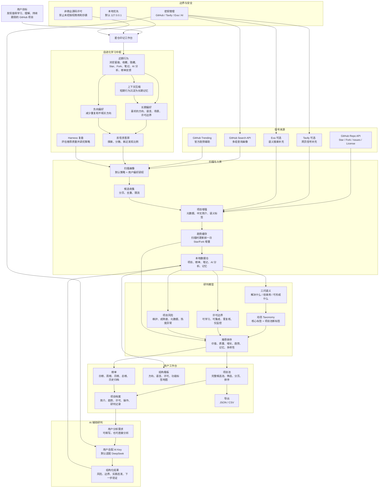
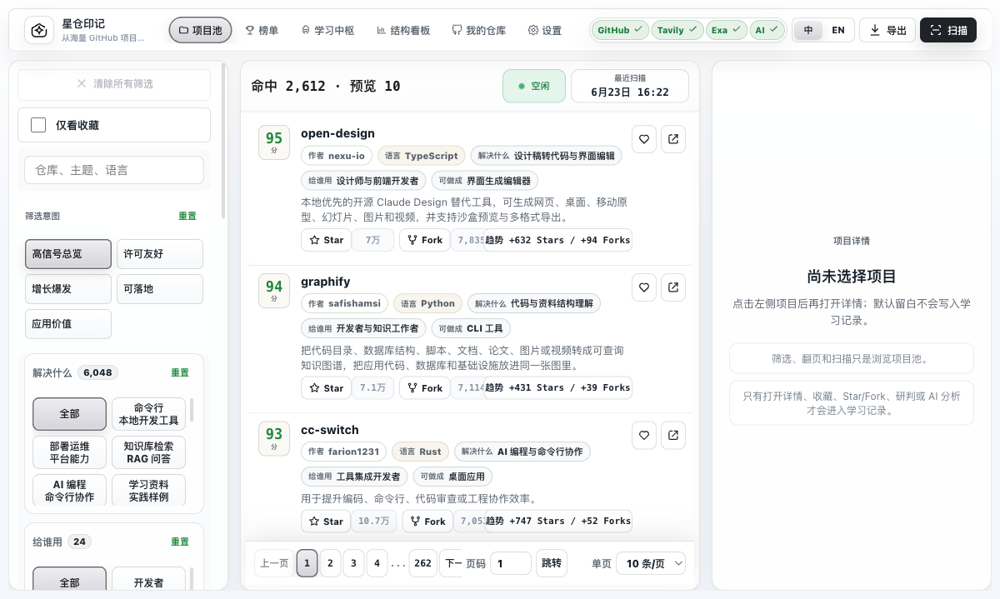
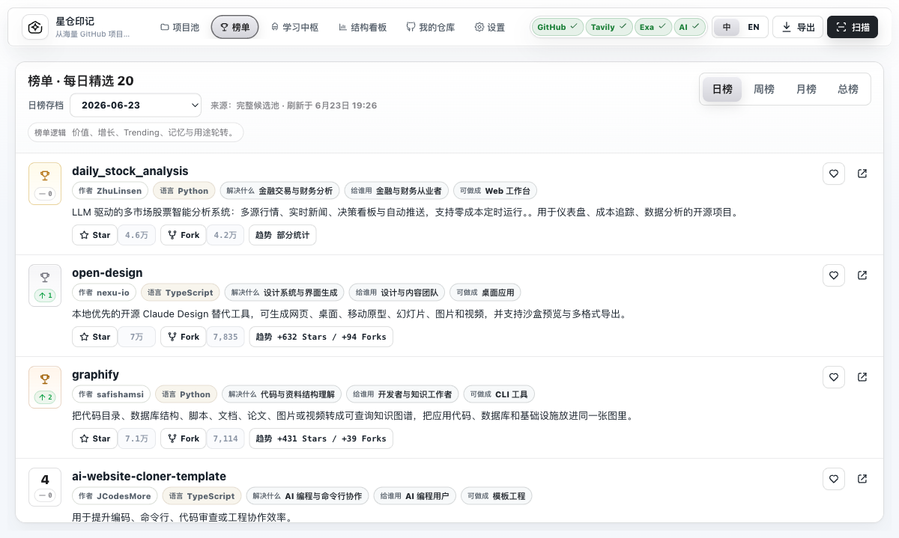
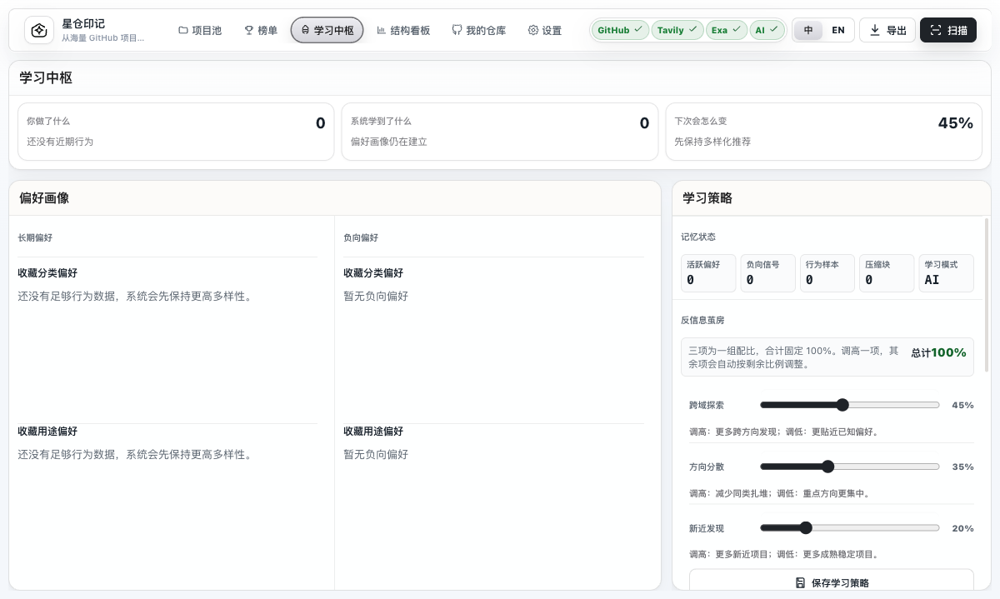
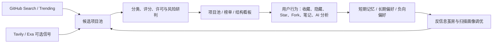

<p align="center">
  
</p>

<h1 align="center">星仓印记 · StarVault Imprint</h1>

<p align="center">
  一个会随用户操作习惯自进化的 GitHub 项目监控与机会研判平台。
</p>

<p align="center">
  <a href="LICENSE"></a>
  <a href="package.json"></a>
  <a href="PRD.md"></a>
  <a href="VISUAL_REGRESSION.md"></a>
</p>

## 项目简介

星仓印记用于从海量 GitHub 项目中发现值得学习、理解、持续跟踪和启发实践的开源项目。它不是简单的 Trending 列表，也不只按 Star 数排序，而是把每个仓库转化为可研判的机会单元：这个项目解决什么问题、给谁用、能形成什么实践形态、热度和质量是否匹配、许可边界是否清楚、是否符合你的长期偏好。

平台会记录用户的收藏、隐藏、Star、Fork、研判记录、AI 分析和榜单反馈；项目详情浏览仅作为近期行为留痕，不参与偏好学习。系统通过长期偏好、负向偏好和反信息茧房策略持续调优后续扫描与排序，让项目池越来越贴近你的判断方式，同时保留必要的探索空间。

## 诞生故事

星仓印记不是从一张完整蓝图开始的。

最开始，它只是一个很朴素的问题：GitHub 每天都有无数项目出现，哪些真的值得停下来多看一眼？不是今天突然冲上 Trending 的热闹，也不是 Star 数最高的安全感，而是那些可能藏着新工具、新工作流、新产品形态和新思路的项目。

问题很快变得复杂。项目太多，标签太乱，简介常常看不出到底能做什么；一类项目连续出现，又让人分不清差异；许可边界、维护状态、趋势真假、同质化风险和个人兴趣混在一起，最后变成满屏信息，却没有一个清楚的判断入口。

于是星仓印记开始一轮轮被打磨。先是项目池，要能完整保留候选项目；再是榜单，要每天精选但不制造信息过载；然后是项目档案，要一眼看清项目解决什么、给谁用、能形成什么实践形态；再后来，学习中枢出现了，因为一个真正有用的工具不应该只给所有人同一张列表，它应该记得你看过什么、收藏过什么、反复研究过什么，也应该知道什么时候把你带出熟悉的方向。

这个过程里，界面被反复推翻，筛选被反复重写，标签从抽象分类变成更接近人话的三问：解决什么、给谁用、可形成什么。AI 分析也从长篇解释收敛成风险、边界、实践启发和下一步验证。系统不再追求把所有信息都摆出来，而是努力把真正需要判断的东西放到最前面。

所以星仓印记更像一个私人开源观察室。它帮你把分散在 GitHub、Trending、搜索引擎和个人行为里的信号收拢起来，慢慢沉淀成自己的判断体系。你不是被动刷项目，而是在训练一套会跟着你一起进化的开源雷达。

## 核心能力

- 项目池：扫描 GitHub 候选项目，按作者、语言、解决什么、给谁用、可形成什么实践形态进行筛选。
- 精选榜单：支持日榜、周榜、月榜、总榜，日榜可归档回溯，默认精选 20 个项目。
- 结构看板：从方向结构、语言、许可和功能标签地图观察当前项目池分布。
- 学习中枢：记录近期行为，沉淀长期偏好与负向偏好，支持上下文压缩和反信息茧房比例调节。
- AI 分析：支持用户输入目标，也支持空输入直接分析，输出风险、边界、实践启发和下一步验证。
- GitHub 集成：支持测试账号、查看个人仓库、Star、Unstar、Fork 和打开仓库地址。
- 多源检索：以 GitHub Search 和 GitHub Trending 为主，Tavily、Exa 作为可选网页信号补充。
- 趋势缓存：扫描时更新 Star/Fork 前一日增量，避免翻页或刷新时频繁请求 GitHub。
- 数据导出：支持 JSON 和 CSV，字段名跟随当前界面语言。
- 双语界面：支持中文和英文切换。

## 构思架构

这套架构来自项目早期到当前版本的产品思路沉淀：先广泛发现，再用许可、风险、趋势、语义和个人偏好做多维研判；既让用户快速看懂项目本身，也让系统通过行为记忆持续学习，但始终保留反信息茧房的探索比例。



## 产品截图

### 项目池



### 榜单



### 学习中枢



## 工作流



## 技术架构

- Runtime: Node.js 22.5+
- Server: 原生 `node:http`
- Frontend: 原生 HTML/CSS/JavaScript，无前端构建链
- Storage: Node 使用 SQLite WAL；Web 静态模式使用 IndexedDB v5 记录级存储；桌面端沿用 SQLite 并规划 Keychain
- Discovery: GitHub Search API、GitHub Trending 辅助、可选 Tavily/Exa
- AI: 默认适配 DeepSeek 的 OpenAI-compatible API，可按 Provider 结构继续扩展
- Scheduler: 内置每日定时扫描、手动扫描和持久化任务恢复
- Quality: 语法、Node 测试、Chromium 多视口视觉矩阵、真实数据存储性能预算

这个版本刻意保持依赖少、链路短、可审计，适合个人本地使用、研究和持续打磨。

## 存储路线

星仓印记按使用形态拆分本地优先存储，避免把用户行为、研判记录和偏好记忆默认上传到远端。

| 形态 | 存储 | 密钥处理 | 状态 |
|---|---|---|---|
| Node 本地服务 | SQLite WAL，项目/方案/扫描按记录写入 | SQLite 本机明文，导出与同步排除密钥 | 当前默认运行路径 |
| Web 静态部署 | IndexedDB v5，项目、榜单和扫描临时结果按记录保存 | IndexedDB 独立密钥记录，portable export 排除密钥 | 已实现 |
| Mac 桌面应用 | SQLite WAL | macOS Keychain | 数据层已就绪，Keychain 尚待打包阶段接入 |

旧 `data/store.json` 只在首次启动时导入 SQLite，之后保持不变，便于人工回退；它不再是运行时主库。即使把 `STORE_PATH` 指向旧 `.json`，服务也会默认迁移到同名 `.db`，只有显式设置 `ALLOW_LEGACY_JSON_STORE=1` 才保留整包 JSON 运行模式。浏览器同步不会下载完整项目池 JSON，而是读取约束后的核心快照、每页 250 个项目和每页 10 份榜单归档；扫描中断时已完成的 profile 可从 IndexedDB 临时记录恢复。桌面端详细设计见 [桌面端本地存储方案](docs/DESKTOP_STORAGE.md)。

## 快速开始

```bash
git clone https://github.com/HachikoJ/starvault-imprint.git
cd starvault-imprint
cp .env.example .env
npm install
npm run dev
```

打开：

```text
http://127.0.0.1:4173
```

运行语法检查：

```bash
npm run check
```

运行完整自动化测试：

```bash
npm run ci
```

运行视觉回归检查：

```bash
npm run visual:check
```

用当前本地数据检查存储性能预算：

```bash
npm run perf:storage
```

用不含用户数据的 6K 合成库复现 CI 性能门禁：

```bash
npm run perf:storage:fixture
```

发布前总门禁：

```bash
npm run release:check
```

运行不调用外部服务的观察方案质量矩阵：

    npm run audit:plans:offline

## 环境变量

| 变量 | 默认值 | 说明 |
|---|---:|---|
| `PORT` | `4173` | 本地服务端口 |
| `HOST` | `127.0.0.1` | 服务监听地址，建议保持本地回环地址 |
| `GITHUB_TOKEN` | 空 | GitHub 扫描、趋势缓存、Star/Fork、我的仓库 |
| `TAVILY_API_KEY` | 空 | 可选网页信号补充 |
| `EXA_API_KEY` | 空 | 可选语义搜索补充 |
| `SCAN_HOUR` | `8` | 每日自动扫描小时 |
| `SCAN_MAX_REPOS` | `800` | 单次扫描保留项目上限 |
| `GITHUB_SEARCH_PAGES` | `2` | 每个查询画像的 GitHub 搜索页数 |
| `GITHUB_TREND_LIMIT` | `80` | 每次扫描刷新趋势缓存的项目数量 |
| `GITHUB_TRENDING_MAX_REPOS` | `60` | GitHub Trending 辅助读取的项目总量 |
| `GITHUB_TRENDING_PER_PERIOD` | `25` | 每个 Trending 周期读取的项目数量 |
| `RUN_SCAN_ON_BOOT` | `0` | 是否启动后自动扫描 |
| `ALLOW_LEGACY_JSON_STORE` | 空 | 仅迁移排障时允许旧整包 JSON 运行；正常部署不要开启 |

也可以在设置页面中配置 GitHub、Tavily、Exa 和 AI Key。Node 模式写入本机 `data/starvault.db`，Web 静态模式写入当前浏览器 IndexedDB；旧 JSON 只作为迁移来源和人工备份，请勿提交任何本地数据。

## 文档

- [PRD](PRD.md)
- [验收清单](ACCEPTANCE_CHECKLIST.md)
- [2026-07-10 发布复盘](RELEASE_READINESS.md)
- [机会分类体系](TAXONOMY.md)
- [风险模型](RISK_MODEL.md)
- [许可边界标签](LICENSE_POLICY.md)
- [视觉回归矩阵](VISUAL_REGRESSION.md)
- [安全说明](SECURITY.md)
- [桌面端本地存储方案](docs/DESKTOP_STORAGE.md)
- [非商业源码许可](LICENSE)

## 安全与隐私

星仓印记当前是本地优先工具，不建议直接暴露到公网。

- `.env` 存放本地环境变量，绝不能提交。
- `data/` 可能包含 SQLite、迁移备份、API Key、GitHub 操作状态、项目笔记、AI 分析、用户行为和长期记忆，绝不能提交。
- Node UI 中配置的 Key 以本机明文形式保存在 SQLite；Web 静态模式的 Key 以独立记录保存在 IndexedDB。设备失守或同源脚本被攻破时不能视为加密密钥库。
- portable JSON、核心快照、项目分页和榜单分页都排除真实 Key；桌面端发布前仍需接入 macOS Keychain。
- 服务端默认监听 `127.0.0.1`。非本机监听强制要求 `AUTH_TOKEN`，并内置 Origin/Fetch Metadata、SSRF、URL 白名单、分级限流、敏感路径拦截、请求体限制、`robots.txt`/noindex 和安全响应头，但没有账号体系或多租户权限模型。
- `/api/settings?reveal=...` 会按本地界面需要返回密钥明文，请只在可信本机环境使用。
- GitHub Star/Fork 会使用你配置的 GitHub Token 操作你的账号。
- AI 分析会把选中仓库信息和你填写的分析需求发送给配置的大模型服务商。
- Tavily、Exa、GitHub 和 AI 服务商会收到相应请求，请自行确认其服务条款与隐私政策。

公网部署前必须增加 TLS、认证网关、访问审计、反向代理/CDN/WAF、DDoS 防护和外部 Secret Manager。不要把 Node 端口直接暴露到公网。详见 [SECURITY.md](SECURITY.md)。

## 发布前检查

```bash
git status --short
git status --ignored --short
npm run check
npm test
npm run visual:check
npm run perf:storage
```

确认以下内容没有进入 Git：

- `.env`
- `data/`
- `.agents/`
- `.playwright-cli/`
- `output/`
- `canvas/`
- `lark-auth-qrcode.png`
- 任何真实 API Key、Token、账号二维码、私有截图或本地扫描快照

## 许可与使用限制

本项目源码采用 [StarVault Imprint Source-Available Non-Commercial License](LICENSE)。

允许个人学习、研究、评估和非商业修改。禁止任何未经授权的商业使用、SaaS 托管、付费交付、白标包装、商业集成、复制抄袭、移除署名或冒名发布。任何抄袭盗用或未经授权的商业行为将被追责。

注意：这里的“非商业源码许可”约束的是星仓印记本项目代码，不代表被监控 GitHub 仓库的许可状态。第三方仓库仍需按其自身许可证和条款使用。

## Roadmap

- 把 Node 端数万级项目的筛选、排序和摘要进一步下推到 SQL，降低全量内存占用。
- 持续用真实陌生领域扩展观察方案审计矩阵，记录模型版本与通过率。
- macOS 端接入 Keychain、签名、公证、沙盒权限和自动更新。
- 面向私有部署补充账号权限、审计日志、外部 Secret Manager 与运维告警。
- 引入 GH Archive / BigQuery 等更稳定的大规模历史趋势数据管道。

## 致谢

感谢 GitHub 开源生态，以及所有认真维护项目、分享经验和持续探索的人。星仓印记希望成为一个更安静、更清楚、更可持续的观察窗口。
