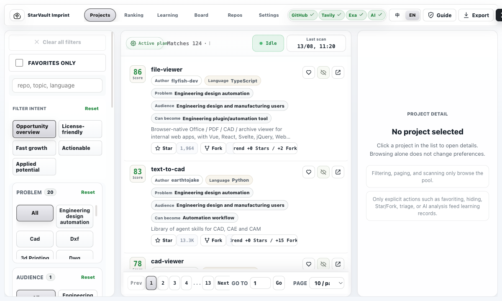
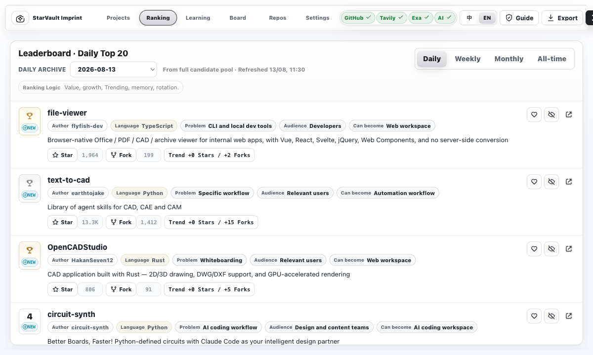
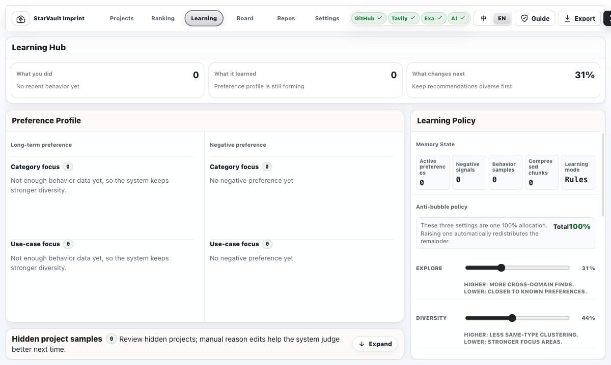
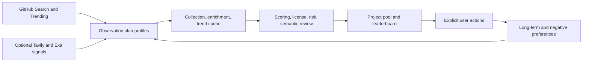

<p align="center">
  
</p>

<h1 align="center">StarVault Imprint</h1>

<p align="center">
  A GitHub project intelligence workspace that evolves with a user's explicit decisions.
</p>

<p align="center">
  <a href="LICENSE"></a>
  <a href="package.json"></a>
  <a href="PRD.md"></a>
</p>

<p align="center">
  <a href="README.md">中文</a> · <strong>English</strong>
</p>

<p align="center">
  <a href="#overview">Overview</a> ·
  <a href="#key-capabilities">Capabilities</a> ·
  <a href="#product-preview">Preview</a> ·
  <a href="#quick-start">Quick Start</a> ·
  <a href="#privacy--security">Privacy & Security</a> ·
  <a href="#source-license--commercial-use">License</a> ·
  <a href="#contact">Contact</a>
</p>

## Overview

StarVault Imprint discovers GitHub repositories worth learning from, evaluating, and following over time. It is not a Trending clone or a simple Star-based ranking. Every repository becomes an opportunity unit: what it solves, who it serves, what tool, service, or workflow it could inspire, whether its activity and quality are credible, whether its license boundary is clear, and how well it fits your evolving preferences.

Explicit actions drive learning: favorites, hides, Star/Fork actions, judgment notes, AI analyses, and leaderboard feedback. Opening a project detail is kept as a recent activity only and does not train preference. Long-term and negative preferences continuously adjust future discovery and ranking while exploration controls preserve room for unfamiliar directions.

## Key Capabilities

- **Project pool:** scan, rank, filter, and inspect a complete candidate pool.
- **Curated leaderboard:** daily, weekly, monthly, and all-time views with daily archives and 20 visible selections.
- **Learning hub:** explicit-action memory, long-term preferences, negative preferences, context compression, and anti-filter-bubble controls.
- **AI analysis:** structured risk, boundary, practical inspiration, and next validation steps using a user-configured provider.
- **GitHub integration:** connection test, personal repositories, Star, Unstar, Fork, and repository links.
- **Observation plans:** separate discovery strategies and memories for different domains, with editable AI-generated GitHub query profiles.
- **Local-first storage:** SQLite WAL for Node, IndexedDB v5 for static web mode, and a desktop-oriented SQLite path.

## Product Preview

### Project Pool



### Leaderboard



### Learning Hub



## Architecture



## Quick Start

```bash
git clone https://github.com/HachikoJ/starvault-imprint.git
cd starvault-imprint
cp .env.example .env
npm install
npm run dev
```

Open `http://127.0.0.1:4173`.

Useful checks:

```bash
npm run ci
npm run visual:check
npm run perf:storage:fixture
```

## Privacy & Security

StarVault Imprint is a local-first, single-user product. Do not commit `.env`, `data/`, API keys, local scan snapshots, user notes, AI results, or behavior records. Node mode uses local SQLite; static web mode uses browser IndexedDB. Neither current mode should be treated as a hardware-backed secret vault.

The Node server defaults to `127.0.0.1`. Do not expose it directly to the public internet. Public deployment requires TLS, an authentication gateway, an external secret manager, audit logging, a reverse proxy/CDN/WAF, and DDoS protection. See [SECURITY.md](SECURITY.md) for the full boundary.

## Source License & Commercial Use

This project is maintained in a private repository and is **not currently published under an OSI-approved open-source license** such as MIT, Apache-2.0, or GPL. It uses the [StarVault Imprint Source-Available Non-Commercial License](LICENSE).

Personal study, research, evaluation, and non-commercial modification are permitted. Commercial use, SaaS hosting, paid delivery, white-labeling, commercial integration, copying, plagiarism, attribution removal, and impersonation are prohibited without the author's prior written authorization.

For commercial licensing, private deployment, joint development, branding, or rights not explicitly granted by the license, contact the author first.

## Contact

- GitHub: [HachikoJ](https://github.com/HachikoJ)
- WeChat: `hostrow` (please add the note "星仓印记")
- Email: `946106011@qq.com`

<table>
  <tr>
    <td align="center">
      <strong>WeChat contact</strong><br>
      
    </td>
    <td align="center">
      <strong>WeChat support</strong><br>
      
    </td>
    <td align="center">
      <strong>Alipay support</strong><br>
      
    </td>
  </tr>
</table>

## Further Reading

- [Chinese README](README.md)
- [Product requirements](PRD.md)
- [Acceptance checklist](ACCEPTANCE_CHECKLIST.md)
- [Security policy](SECURITY.md)
- [Desktop local storage design](docs/DESKTOP_STORAGE.md)
